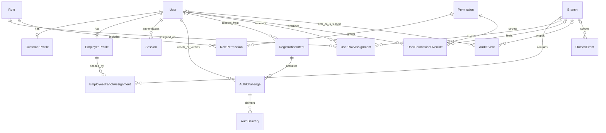

# Phase 1: authentication, Owner and authorization design

Status: Step 1 design for review; no runtime implementation or schema changes.

This document defines the proposed contracts and security design for PRD Phase 1.
The [PRD](../LUCY_SPA_PRD.md) remains authoritative for product requirements. The
[handoff](../LUCYSPA_HANDOFF.md) remains authoritative for architecture except for
its already disproven pre-commit snapshot. The inspected baseline is commit
`807ed8c`: Phase 0 is pushed and CI passed; only `branches` and `outbox_events` exist.
The pre-existing `apps/web/next-env.d.ts` development-path change is unrelated and
must remain untouched.

All numeric security settings below are **proposed engineering defaults**, not
new spa business policies. They implement PRD sections 6, 7, 42, 44, 51 and 56.
The PRD recommends the initial five-minute OTP lifetime; other limits are design
choices subject to security testing. No real accounts, credentials or branches
are supplied by this document. Step 2 requires a separate review and approval.

## 1. Architecture and scope

PRD basis: sections 5, 6, 7, 39, 41, 42, 44, 48, 56 and 58.

- NestJS owns identity normalization, credentials, sessions, authorization and
  audit transactions. Add domain modules to the existing API, with a shared
  injectable Prisma provider rather than unrelated clients per service.
- Next.js owns presentation and an HTTP forwarding boundary only. It continues
  to use public contracts/UI; it never imports database or backend packages.
- PostgreSQL owns identities, sessions, challenges, delivery intent, permissions
  and audit history. Redis may accelerate abuse controls and carry BullMQ jobs;
  losing it cannot reactivate a revoked session or reset a challenge's attempts.
- Extend the existing transactional outbox narrowly for authentication email.
  Delivery processors, adapters and dispatch are later implementation steps.
- This document contains the proposed wire contracts. Do not export unused
  executable contracts or add dependencies before their implementation step.
- Services, skills, operational assignments, attendance, bookings, payments,
  loyalty, payroll, inventory, notifications UI and the full audit UI are outside
  this design. Employee branch membership here exists only for authorization.
  Base salary is profile data, not a payroll calculation. Points never expire;
  no loyalty entities or expiration machinery are introduced.

## 2. Account model and lifecycle

PRD basis: sections 6.1-6.6, 7.1-7.3, 12, 41 and 42.

`User` is the authentication principal, with immutable `kind` equal to
`CUSTOMER`, `EMPLOYEE` or `OWNER`. It holds fullName, preferredLocale, credentials
and canonical contact identifiers. Profiles hold domain-specific information. A customer has exactly
one `CustomerProfile`; an employee exactly one `EmployeeProfile`. Owner identity
does not require an employee profile, salary or a branch. Owner authority comes
from the protected principal kind, never from an assignable role called OWNER.

Use one unique namespace for non-null canonical email and phone across Users;
do not create duplicate identities, silently merge accounts, or convert a staff
principal into a customer principal. A person needing both capacities requires
an explicitly reviewed extension, not automatic account linking.

| Record/state                            | Meaning and permitted transition                                                                         |
| --------------------------------------- | -------------------------------------------------------------------------------------------------------- |
| RegistrationIntent: pending             | Candidate customer details and password hash; no User, login, membership or reserved unique identity yet |
| RegistrationIntent: completed           | Email OTP and flow capability verified; User and profile created atomically as ACTIVE                    |
| RegistrationIntent: expired/invalidated | Cannot activate; begin a new registration; never revives an old challenge                                |
| User: PENDING_SETUP                     | Employee only; authorized creation completed, but employee has not established a password                |
| User: ACTIVE                            | Can authenticate if credentials, session and verification prerequisites pass                             |
| User: INACTIVE                          | Employee only in Phase 1; cannot authenticate; history retained; authorized reactivation possible        |
| Owner                                   | Created ACTIVE with a password by explicit bootstrap; always remains ACTIVE                              |

Customer registration requires full name, calendar DOB, address, email, phone
and password. Store DOB as a date, not a timezone-dependent timestamp. Do not
invent a minimum customer age. Customer accounts become ACTIVE only after email
verification. Email activation does not prove control of the supplied phone.

Public signup always creates a customer intent; reject role, kind, status,
permission, salary and branch fields rather than accepting mass assignment.
Staff cannot use an administrative route to register normal adult customers.
There is no customer impersonation feature.

Employee creation requires the PRD identity/profile fields and explicit branch
scope. Store unknown base salary as null until supplied, never as a fabricated
zero or formula. Skills are deferred to Phase 2. Employee email is optional
because PRD 7.1 does not require it. Employee ID is a unique staff login identifier
(trim surrounding whitespace, uppercase ASCII; proposed syntax `[A-Z0-9_-]`,
1-64 characters). Email, if supplied for recovery, must be verified independently.

Proposed login identifiers: customers use email; employees use employee ID;
Owner uses email. A verified employee email may also be used in the WORKFORCE
realm. Phone is a unique contact identifier, not a login or recovery factor in
this phase. Login includes an explicit CUSTOMER or WORKFORCE realm and identifier
type, avoiding ambiguous lookup. A credential match in one realm grants no
access in the other.

Owner bootstrap takes identity and a password through a protected local/operator
channel, not a public endpoint, default password, committed seed or command-line
secret. It does not claim email verification merely because an operator entered
an address. Owner can sign in after bootstrap; email recovery is enabled only
after proving that email through the recovery-email verification flow.

Employee setup uses a random, single-use 256-bit setup capability handed over
through an authorized secure channel. The employee chooses the password; an
administrator cannot retrieve it. Proposed setup lifetime: 24 hours. Only a
specifically authorized operation can reissue a setup capability; it must revoke
the prior capability and, for an existing employee credential, existing sessions.
This is never available against Owner or customers.

Reissue to an ACTIVE employee clears the old password hash, increments the
credential version and moves the account to PENDING_SETUP in the same transaction.
Redemption changes PENDING_SETUP to ACTIVE after establishing the password; it
cannot reactivate INACTIVE employment. Inactivation invalidates outstanding setup
and reset flows. Explicit authorized reactivation returns to ACTIVE only if a
credential remains; otherwise it returns to PENDING_SETUP. No old sessions revive.
Setup issuance/redemption also obeys the target-authority protections in section 7.

## 3. Canonical identifiers

PRD basis: sections 6.1, 6.5, 20.1 and 42. Canonicalization is server-owned,
versioned and identical across signup, login, recovery and authorized creation.
Client normalization is a convenience, never the authority. Uniqueness is
enforced by database indexes, including concurrent requests.

### Email

1. Remove surrounding ASCII whitespace; reject embedded controls, CR/LF and
   display-name/address-list forms. Parse exactly one mailbox with a maintained
   validator. Bound input before parsing.
2. Proposed initial supported syntax: ASCII dot-atom local part plus a DNS domain,
   including internationalized domains converted by a maintained IDNA processor
   to ASCII. Reject empty labels, invalid IDNA and malformed dot placement.
   Quoted local parts, domain literals and SMTPUTF8 local parts require explicit
   adapter support before acceptance; do not silently transliterate them.
3. Preserve the local part's submitted case for delivery. Lowercase the ASCII
   domain. Store this as `emailDelivery`; preserve a safe display representation
   if needed, but never render it as trusted HTML.
4. `emailCanonical = ASCII-lowercase(local part) + '@' + lowercase(IDNA domain)`.
   This is Lucy Spa's case-insensitive identity comparison policy, not a claim
   that every SMTP server treats local-part case identically. Enforce local-part
   and total address limits through the validator (64 and 254 octets respectively).
5. Do not remove dots, strip `+tags`, rewrite providers or merge lookalike Unicode
   domains. `linh+spa@example.com` and `linh@example.com` remain distinct keys.
6. Recovery always sends to the stored verified `emailDelivery`, never the
   submitted spelling that merely matches its canonical key. A case-colliding
   signup cannot overwrite an existing address, password, profile or verification.

Example: `Linh.Spa+member@EXAMPLE.COM` compares as
`linh.spa+member@example.com`; delivery retains `Linh.Spa+member@example.com`.
If a mail server distinguishes local-part case, only the first verified identity
can own that comparison key. An email proof for a differently cased address must
never authorize taking over the existing User.

These rules follow the separation of comparison and delivery described in
[OWASP email guidance](https://cheatsheetseries.owasp.org/cheatsheets/Email_Validation_and_Verification_Cheat_Sheet.html).
Future normalization changes require a collision review and migration plan;
never rewrite identity keys opportunistically during login.

### Vietnamese phone numbers

- Default region is VN for national input. Accept ASCII digits, one leading `+`,
  ordinary spaces, parentheses, hyphens and dots; reject other characters,
  extensions, vanity letters and embedded prose before parsing.
- After removing permitted presentation punctuation, accept VN national `0...`
  or explicit `+<country code>...`. Convert an explicit `0084...` prefix to `+84...`.
  Reject a bare `84...` or other ambiguous national form; request `0...` or `+...`.
  Reject `+840...` rather than silently guessing away the trunk prefix.
- Parse and validate with maintained libphonenumber-compatible full metadata;
  format as E.164. Do not freeze carrier-prefix lists in application code or
  validate length alone. Record the normalization version.
- `0912 345 678` becomes `+84912345678`; `028 3822 1234` becomes
  `+842838221234`. Both domestic and equivalent `+84` input compare identically.
- Accept valid fixed-line as well as mobile numbers. Explicit international
  numbers use their country metadata; the PRD does not prohibit non-VN customers.
  Numeric validity does not establish allocation, reachability or ownership.
- Store the canonical number once; presentation formatting can be derived.
  There is no `phoneVerifiedAt` claim and no SMS dependency in this design.

The parser's permissive behavior makes the input precheck necessary; see the
[libphonenumber FAQ](https://github.com/google/libphonenumber/blob/master/FAQ.md).
An unverified phone must never authorize account recovery, merging or transfer.
Phone correction/dispute handling is not invented here.

## 4. Passwords

PRD basis: sections 6.3, 6.4 and 44.

- Use Argon2id through a maintained implementation compatible with Node 24 and
  the existing development/CI platforms. Proposed target: 64 MiB memory,
  3 iterations, parallelism 1, unique CSPRNG salt of at least 16 bytes and a
  32-byte output. Benchmark during implementation; never silently fall below
  19 MiB / 2 iterations / parallelism 1. Limit concurrent hashing work.
- Store the PHC-encoded hash, including algorithm and cost/salt parameters.
  Rehash after successful authentication when parameters are outdated, using a
  compare-and-update guard so concurrent password reset cannot be overwritten.
  A cost-only rehash does not change the credential security version.
- No reversible encryption, plaintext, password logging, password-returning DTO,
  default password or staff-readable password. Password peppering is not required
  for this initial design; OTP HMAC keys are separate secrets.

Argon2id and its baseline are supported by
[OWASP password-storage guidance](https://cheatsheetseries.owasp.org/cheatsheets/Password_Storage_Cheat_Sheet.html).

Proposed policy: 15-128 Unicode code points after NFC normalization; preserve
case and spaces, never trim or truncate, and use the same normalization on every
password entry path. Allow paste/password managers and passphrases. Reject known
common/compromised passwords through a local maintained blocklist when setting
or resetting a password. Do not impose character-class mixtures, periodic
rotation or security questions. The choice follows
[NIST password guidance](https://pages.nist.gov/800-63-4/sp800-63b.html#passwords).
Email activation/reset is not MFA and this design makes no NIST assurance-level
compliance claim. Library selection and benchmarks occur later; no package is
installed in Step 1.

## 5. Browser sessions, cookies and CSRF

PRD basis: sections 6.6, 44, 46 and 48.

### Transport and session authority

Use a same-origin browser API path (`/api/...`) forwarded to the existing Nest
process by the web/deployment HTTP boundary. Nest still owns all authentication.
Forwarding does not import backend packages or move business rules into Next.js.
Do not make cross-site third-party cookies a Phase 1 dependency. Public origin
and upstream routing are validated server configuration, never request-supplied
redirect destinations. Existing standalone health endpoints remain available.

The browser gets a CSPRNG 32-byte opaque session token in a cookie. PostgreSQL
stores only its SHA-256 digest, a unique index, lifecycle timestamps and User FK.
The entropy makes a plain digest suitable for session/setup capabilities; it is
not suitable for six-digit OTPs. No JWT claims, refresh-token subsystem or bearer
tokens in localStorage/sessionStorage are needed. Multiple sessions are allowed.

Every protected request checks token digest, expiry, revocation, current User
status/kind, credential version and authorization version. PostgreSQL is the
authority; failure to read it fails closed. Do not trust a cached role or browser
supplied user/branch identity. Redis is not the sole session store.

Limits: anonymous pre-auth session 15 minutes absolute; authenticated session
**60 minutes idle** (sliding on genuine user activity; originally proposed as 30
minutes) and 12 hours absolute; fresh password reauthentication valid for 5 minutes for
sensitive actions. Background polling must not extend idle time indefinitely. Server
clocks/timestamps enforce limits. No remember-me mode is added. Values are centrally
validated security configuration (`AUTH_IDLE_TTL_SECONDS` default 3600,
`AUTH_ABSOLUTE_TTL_SECONDS` default 43200).

**Session activity (implemented after Phase 2 deployment).**

- **The gap it closes:** until then, no endpoint refreshed activity, so
  `lastActivityAt` stayed fixed at login and every session ended 30 minutes after login
  even while in use (the Phase 1 Step 13 carried-forward decision). A production Owner was
  logged out this way while creating services.
- **Sliding idle:** genuine user activity refreshes `lastActivityAt` and restarts the
  60-minute idle window. Sixty minutes without genuine activity expire the session. An open
  but untouched page does not keep it alive.
- **Counts as activity** (`isUserActivity`, `apps/api/src/auth/session-activity.ts`):
  - every authenticated `POST` command under `/api/v1`, after the global JSON,
    exact-Origin and CSRF guard has accepted it;
  - a `GET` under `/api/v1` that the workforce client marks `X-Lucy-Activity: user`. The
    client marks reads caused by navigation or an explicit user action.
- **Never counts:**
  - unmarked `GET`s (background or automatic reads);
  - `/api/v1/auth/context` and `/api/v1/auth/me`, even if marked;
  - health checks, other paths, and `HEAD`/`OPTIONS`;
  - login, logout and reauthentication, which replace or revoke the session instead.
- **Recording:** the global `SessionActivityInterceptor` records after the handler
  finishes. It runs only for requests that passed the guards, so a CSRF-rejected request is
  never counted.
  - `SessionService.recordActivity` first reads the session without locks. It writes only
    when the session is authenticated, not idle- or absolute-expired, and its recorded
    activity is at least one write interval old.
  - The write goes through the existing `touch`, which revalidates everything under locks
    (revocation, credential/authorization versions, key version, expiry).
  - Activity never revives an expired or revoked session, never authorizes anything, and a
    recording failure never fails the request.
- **Write coalescing:** at most one write per interval of `min(60 s, idle / 10)`, so 60 s
  by default. Recorded activity lags real activity by less than one interval (at most 10%
  of the idle timeout), so coalescing cannot expire an active user.
- **Absolute expiry:** activity only moves `lastActivityAt` forward. `absolute_expires_at`
  is immutable (the `sessions_lifecycle_guard` trigger), so the 12-hour limit is never
  extended.
- **Expiry in the workforce UI:**
  - a failed submission keeps the page and its entries (nothing was saved) and offers
    sign-in in a new tab, after which the user saves again;
  - a failed read returns to login with the current page as the return path, and
    sign-in returns there.
  - No token, password or CSRF secret is stored in web storage.
- **Remaining unsaved-form limitations (follow-ups, not implemented):**
  - if a _read_ hits the expiry while a form has unsaved changes, the redirect to login
    still discards them (forms don't issue reads after a failed submit, so this is
    uncommon);
  - there is no in-page sign-in dialog and no warning before leaving a dirty form;
  - after signing in as a _different_ user in the new tab, the kept page's permission
    hints stay stale until reload (the server still authorizes every request).
- **Tests (all pass):**
  - `session-activity.test.ts` 7/7 (fixed clock): the idle deadline advances; an active
    user survives past 60 minutes after login; 60 minutes of inactivity expire (14:20 →
    15:20); the 12-hour cap holds; polling cannot keep a session alive; coalescing never
    expires an active user; activity classification.
  - `session-activity.http.test.ts` 1/1: commands record activity; CSRF-rejected requests
    record nothing; 403/401 decisions are unchanged; unmarked reads, `/auth/me`,
    `/auth/context` and health never count; recording failures never fail requests.
  - `session.integration.test.ts` 12/12 (real PostgreSQL, rolled back): passive
    resolution never writes; throttled write; absolute expiry unchanged; idle-expired
    and revoked sessions are neither revived nor refreshed; invalid and anonymous tokens
    are rejected.
  - Web 33/33: the activity marker appears only on user reads; a failed submit keeps
    the page while a failed read redirects; the return path round-trips through
    `safeNext`.
  - API unit/HTTP 85 pass; server 19/19.

Replace the session token at login and reauthentication; invalidate the previous
token without an overlap window. Reset/change of password, employee inactivation,
setup reissue and security-grant changes revoke affected authenticated sessions.
Increment the corresponding User version in the same transaction. Logout revokes
the current session and clears its cookie. Logout-all revokes all that User's
sessions. Never create an authenticated session as a side effect of OTP activation
or password reset; require normal login.

Login may perform the expensive password check before its transaction, but must
recheck User state, the credential version/hash it checked and authorization
version under lock before creating the session. A concurrent reset or inactivation
must not be followed by a login using the old credential. A sensitive mutation
rechecks session and authorization inside its own transaction as well.

This implements revocable sessions and server-enforced expiry consistent with
[OWASP session guidance](https://cheatsheetseries.owasp.org/cheatsheets/Session_Management_Cheat_Sheet.html).

### Cookie contract

Production cookie: `__Host-lucy_session`; `Secure`; `HttpOnly`; `SameSite=Lax`;
`Path=/`; no `Domain`; no JavaScript-readable session copy. Use a browser-session
cookie without a persistent Max-Age; database expiry still applies even if a
browser restores it. Clear with the identical name/path/security attributes and
`Max-Age=0`. All authentication/profile responses use `Cache-Control: no-store`.

Only explicitly configured local development on loopback HTTP may use
`lucy_session_dev` without Secure; keep HttpOnly, SameSite and host-only behavior.
Production startup rejects this exception. Use one loopback hostname consistently
through the forwarding boundary. Trust forwarded protocol/address headers only
from explicitly configured proxies, never arbitrary client headers.

The prefix/attribute requirements are documented by
[MDN Set-Cookie](https://developer.mozilla.org/en-US/docs/Web/HTTP/Reference/Headers/Set-Cookie).

### CSRF contract, including unauthenticated authentication routes

`GET /api/v1/auth/context` obtains/validates a short-lived anonymous or authenticated
Session and returns a CSRF token. This is technical session initialization, not a
business mutation. Rate-limit anonymous session creation. CSRF token is
`HMAC-SHA256(Kcsrf, length-prefixed('csrf-v1', session-id, raw-session-token))`,
base64url encoded. Store the key version with the Session. This is a signed,
session-bound token; it is not an unbound double-submit cookie. Keep the returned
token in page memory and retrieve it again after reload. The API recomputes and
compares it in constant time; a database token digest cannot derive it.

For every POST/PATCH/PUT/DELETE, including register, login, OTP, reset, setup and
logout, require JSON content type, a valid session-bound `X-CSRF-Token`, and an
exact allowed Origin. If Origin is absent, require an exact Referer origin;
reject null/missing/untrusted origins. No substring/domain-suffix checks. GET
and HEAD do not change business state. Fetch Metadata is additional defense,
not a replacement for the token/origin checks. Do not expose token responses
through permissive CORS. Retain exact-origin CORS; no wildcard credentials or
reflection of arbitrary Origin. Rotating a session changes its CSRF token;
clients must fetch a new context. Apply the same protections to future forwarding
routes; the proxy is not an authentication or CSRF bypass.

SameSite alone is insufficient; this combination follows
[OWASP CSRF guidance](https://cheatsheetseries.owasp.org/cheatsheets/Cross-Site_Request_Forgery_Prevention_Cheat_Sheet.html).

## 6. Activation, reset and challenge security

PRD basis: sections 6.2, 6.4, 6.5, 42, 44, 48 and 51.

### Challenge material and proposed limits

| Setting                      | Proposed initial behavior                                                                                  |
| ---------------------------- | ---------------------------------------------------------------------------------------------------------- |
| Email code                   | Uniform CSPRNG integer 0-999999, formatted as exactly six digits including leading zeros                   |
| Code lifetime                | 5 minutes from generation; exact expiry boundary is invalid; retry never extends it                        |
| Registration intent lifetime | 30 minutes; resend does not extend the intent lifetime                                                     |
| OTP flow lifetime            | Activation: 30 minutes, bounded by parent intent; reset/recovery-email: 15 minutes; fixed at flow creation |
| Verification failures        | At most 5 per flow across resends; then invalidate the flow                                                |
| Identity failure budget      | 10 verification failures per 15-minute window across flows/purposes                                        |
| Resend cooldown              | At least 60 seconds between sends to the same canonical email                                              |
| Email issuance budget        | At most 5 per hour and 10 per day per canonical email, across flows/purposes                               |
| IP issuance budget           | At most 30 per hour across identities; configurable for shared spa networks                                |
| IP verification budget       | At most 100 attempts per 15 minutes across identities                                                      |
| Login failure budget         | 10 per 15 minutes per realm/identifier and 100 per 15 minutes per IP                                       |
| Setup capability lifetime    | 24 hours; high-entropy capability, not a six-digit OTP                                                     |

Use Node's unbiased
[crypto.randomInt](https://nodejs.org/docs/latest-v24.x/api/crypto.html#cryptorandomintmin-max-callback)
or equivalent reviewed CSPRNG API, never Math.random. Technical cooldowns do not
set a User to INACTIVE, permanently lock Owner or implement customer punishment.
Identity budgets apply equally to known and unknown identities. Counts use
atomic PostgreSQL buckets with server-defined fixed UTC windows and a separate
`nextAllowedAt` cooldown; window-boundary bursts are bounded by cooldown/IP caps.
Redis may impose additional coarse limits. If authoritative limits cannot be
checked, reject issuance/verification safely rather than fail open.

Store OTP verification as HMAC-SHA256 under a separate random 32-byte-or-stronger
server key held outside the database. Bind an unambiguous, length-prefixed tuple
of purpose, challenge ID, generation, subject/intent ID, target canonical email,
credential version where applicable, and code. Store digest and key version,
never plaintext or a plain unkeyed fast hash. Compare fixed-length digests in
constant time. Maintain independent OTP, CSRF, throttle-pseudonym and delivery
encryption keys; key rotation must retain required versions for live artifacts
or explicitly invalidate them, never bypass verification on a missing key.

Each flow also has a random 256-bit `flowToken` with only its SHA-256 digest stored.
Verification requires both that capability and the OTP. The token identifies a
specific flow, not just an email. It is not an account session. Keep it in page
memory, send only in JSON over HTTPS, never query strings or logs. Unknown or
suppressed issuance returns an indistinguishable random dummy token.

Store immutable `flowExpiresAt` separately from `codeExpiresAt`. An expired code
may be replaced by a permitted resend while its flow is still live; an expired,
consumed, invalidated or exhausted flow cannot be revived. Set each generation's
codeExpiresAt to `min(generatedAt + 5 minutes, flowExpiresAt)`. Only email challenges
have a code deadline; a setup capability uses its own 24-hour flow deadline.

### Customer activation and duplicate signup

1. Validate and normalize the submitted candidate profile/password. Within abuse
   limits, hash the password and create an expiring RegistrationIntent and an
   ACTIVATE_CUSTOMER challenge, plus durable email intent. Unique User keys are
   not reserved by unverified registrations.
2. A request colliding with an existing User gets the same public accepted
   response, but cannot alter that User or send activation for it. A repeated
   pending signup is a separate candidate flow; never update another flow's
   password/profile. Issuance serializes by canonical email/purpose and supersedes
   older actionable codes for that identity. Budgets survive new flow creation.
3. The browser submits its own flowToken and email OTP. In one transaction, lock
   the identity/challenge state, verify the bound candidate and limits, insert the
   ACTIVE User and CustomerProfile with unique canonical email/phone, record
   emailVerifiedAt, consume the challenge/intent, invalidate sibling activation
   challenges, and append the audit event. Do not create a session.
4. If uniqueness loses a race, roll back account creation and return generic
   `VERIFICATION_FAILED`; invalidate the unusable flow in a subsequent safe
   transaction. Never attach verified email to the conflicting existing User.

This prevents activation of an attacker's stored password: an OTP for one intent
cannot activate the credentials from a different intent. Possessing the email
alone does not recover another flow's capability; a legitimate user can start a
fresh candidate flow. An abandoned intent cannot indefinitely squat on a unique
email/phone. A verified signup still does not prove phone ownership; existing
User phone collisions are not resolved by automatically taking the number.

### Forgot password and workforce recovery email

For an ACTIVE User with verified email in the requested realm, issue a
RESET_PASSWORD flow to its stored verified delivery address. Ineligible and
unknown identities get the same accepted response. Do not activate a pending
employee or reactivate an inactive one through reset. Customers without a User
restart signup. Owner can use self-service recovery after email verification;
staff cannot invoke an administrative reset on Owner.

Complete reset in a single operation taking flowToken, OTP and newPassword;
there is no intermediate reusable "OTP verified" flag or reset bearer grant.
Validate/hash the new password, then lock and recheck User state, email identity,
credential version, challenge generation, attempts and expiry. Consume the
challenge, change password, increment credentialVersion, revoke all sessions and
other reset/setup challenges, and append audit atomically. Return success only
after commit; require login with the new password.

An authenticated Owner/employee with an existing unverified recovery email may
request VERIFY_RECOVERY_EMAIL after fresh password reauthentication. The OTP is
bound to that User and that already stored address, cannot change the address,
and only marks it verified. It does not reset a password or change account state.
Employees without email use their authorized setup/recovery arrangement.

Generic profile/admin patches must reject email/phone changes. Dedicated contact
change flows require fresh password proof, verified confirmation of the new email
and notification to the old email; a phone change requires explicit verification
of the authenticated account and uniqueness checks, without falsely claiming SMS
ownership. Those contact-change endpoints are not added by this Step 1 contract;
review their exact flow before exposing them. No unverified edit shortcut exists.

These recovery constraints follow
[OWASP forgot-password guidance](https://cheatsheetseries.owasp.org/cheatsheets/Forgot_Password_Cheat_Sheet.html).

### Atomic attempts, resends and delivery

- Serialize issuance/resend by a deterministic identity/purpose transaction lock;
  lock relevant throttle buckets in a stable order. Expire/invalidate the old
  actionable challenge before issuing the next. At most one is actionable for
  the same identity and purpose. Different purposes cannot verify each other.
  Expired rows still covered by the partial unique index receive invalidatedAt
  under that lock before a replacement is inserted.
- Verification locks the same identity and challenge before checking or consuming.
  Increment failed counters in a transaction that commits even when the response
  is an error. Throwing an exception that rolls back the debit is a security bug.
- Resend rotates the code/generation and creates a new delivery record; it does
  not reset failure budgets, change candidate data or extend the flow lifetime.
  Prior generations, consumed flows and expired flows are always rejected during
  verification; a resend can replace an expired code only within its live flow.
- Throttle unknown flows by IP and supplied identity where present. Return the
  same invalid-verification result for unknown, wrong, expired, exhausted,
  replayed, superseded and ineligible flows. Validation syntax may be explicit.
- Store deliverable OTP material only in a short-lived `AuthDelivery` encrypted
  envelope (AES-256-GCM with unique nonce and authenticated challenge/generation
  context). The separate key is external to the database. The worker needs this
  temporary ciphertext because an HMAC digest cannot reconstruct an email code.
- The outbox payload contains only delivery ID and event version, never OTP,
  password/hash, email or flowToken. BullMQ jobs carry the delivery ID only.
  Worker checks expiry/generation/status before send; late in-flight obsolete
  mail cannot authenticate because verification rechecks the same state.
- Retry the same delivery/code with a stable delivery ID/provider idempotency
  key where supported. Never generate another OTP on a delivery retry. Do not
  promise exactly-once email; duplicate mail must be harmless. Bound retries by
  code expiry. Erase ciphertext on delivery, final failure, supersession or expiry.
- Expired intents, challenge secrets, delivery ciphertext and expired anonymous
  sessions are transient security data, eligible for bounded cleanup. Proposed
  cleanup deadline for terminal intents/challenges: within 24 hours. Preserve
  permanent audit/employee records; these are not cleanup targets.

## 7. Roles, overrides and branch scope

PRD basis: sections 5, 7.2, 7.3, 39, 41, 42 and 44.

Role is a named permission bundle. `SENIOR_MANAGER`, `TEAM_LEADER` and `STAFF`/`KTV`
are suggested labels, not hard-coded authority levels. Do not infer a production
permission matrix from them. Permission codes and semantics are code-owned;
unknown codes are denied. Owner may configure bundles/assignments once implemented.
Customer self-service is explicitly limited to the authenticated customer's own
record and is not enabled through workforce roles.

Proposed Phase 1 permission catalog:

| Permission             | Authorized capability, still subject to scope and invariants                   |
| ---------------------- | ------------------------------------------------------------------------------ |
| VIEW_EMPLOYEES         | Read necessary employee identity/status; excludes password and base salary     |
| CREATE_EMPLOYEES       | Create employee identity in explicitly permitted branches                      |
| UPDATE_EMPLOYEES       | Edit non-security profile fields; excludes contact identifiers and base salary |
| MANAGE_EMPLOYEE_STATUS | Inactivate/reactivate employees; never Owner                                   |
| MANAGE_EMPLOYEE_ACCESS | Issue/reissue employee setup credentials; never customer/Owner credentials     |
| MANAGE_EMPLOYEE_SCOPE  | Change employee authorization branch membership; not scheduling assignments    |
| VIEW_EMPLOYEE_PAY      | Read supplied base salary only                                                 |
| MANAGE_EMPLOYEE_PAY    | Change supplied base salary only; no payroll calculation                       |
| MANAGE_PERMISSIONS     | Assign roles/overrides; GLOBAL scope additionally permits shared role editing  |
| VIEW_AUDIT_LOG         | Read permitted audit records through a controlled backend boundary; UI later   |

Role assignment and individual override each have explicit scope:
`GLOBAL` with null branch ID, or `BRANCH` with a non-null Branch FK. An override
has `ALLOW` or `DENY`; removal restores inheritance. A GLOBAL grant for a
branch-capable permission explicitly authorizes all branches, including future
branches. A BRANCH grant is effective only with an active EmployeeBranchAssignment
to that same active branch. Membership alone grants no action permission.

Evaluation for permission P against a persisted resource in branch B:

1. Validate the authenticated principal/session, supported operation and target.
   Obtain B from authoritative resource data; do not trust a submitted branch ID.
2. Apply Owner and target-protection rules. Owner passes permission/scope checks
   but still undergoes authentication, validation, CSRF, audit and domain checks.
3. For non-Owner, an applicable GLOBAL or matching BRANCH DENY rejects P.
4. Otherwise allow an applicable explicit ALLOW or role permission grant. A
   branch-specific ALLOW/role assignment requires current branch membership.
   Otherwise deny. Absence of any grant is a denial.
5. For a global resource require GLOBAL authority. Branch membership never grants
   global access. For a multi-branch mutation evaluate every affected branch,
   including old and new scopes; one denial rejects the entire transaction.

| Effective inputs for branch B                             | Result          |
| --------------------------------------------------------- | --------------- |
| Role grant in A, no global grant, resource in B           | Deny            |
| Role grant in B, no active B membership                   | Deny            |
| Global ALLOW plus B DENY                                  | Deny in B       |
| Global DENY plus B ALLOW                                  | Deny in B       |
| B ALLOW plus active B membership, no applicable DENY      | Allow in B only |
| Branch grant with null requested branch for global action | Deny            |
| No grant or unknown permission                            | Deny            |

Filter lists/queries by authorized scope before pagination/counts. Repeat object
authorization for reads and writes; hiding UI actions is not enforcement. A
global employee profile/status/credential/pay change affects all that employee's
active branches: require permission for all of them, not just a shared branch.
For an employee without any active branch, require GLOBAL permission. Sensitive
pay fields remain absent unless VIEW_EMPLOYEE_PAY passes for the full target.

### Delegation and escalation prevention

- Creating/editing an employee does not implicitly grant MANAGE_PERMISSIONS or
  permit role, kind, verification, credential or scope fields in a profile patch.
  Adding initial roles requires separate grant authority in the same transaction.
- Non-Owner cannot modify their own roles, overrides or branch access, nor a shared
  role assigned to themselves. They cannot affect Owner or grant an OWNER kind.
- Grant/revoke operations require MANAGE_PERMISSIONS at the old and new affected
  scopes. A non-Owner may grant only permissions and scopes they effectively hold,
  and only to targets within their administrative scope. Removing a DENY counts
  as a grant. Moving a scope or editing a bundle checks its resulting powers.
- Shared role-definition changes require GLOBAL MANAGE_PERMISSIONS and checks
  across every affected recipient and old/new branch scope. A global delegation
  cannot bypass an applicable branch DENY. If the actor cannot administer all
  affected recipients, reject; use a narrower role or scoped override instead.
- Branch expansion requires MANAGE_EMPLOYEE_SCOPE for old/new branches and
  MANAGE_PERMISSIONS if it activates any previously ineffective grant; expanded
  resulting rights cannot exceed the actor's effective authority.
- MANAGE_EMPLOYEE_ACCESS is credential-control authority. A non-Owner cannot
  issue a setup/recovery capability for themselves or for a target whose complete
  effective authority exceeds their own, including global grants and permission
  management powers. Branch overlap alone is insufficient. Enforce containment
  over global capabilities and every effective branch, accounting for DENYs;
  Owner can provision any employee but never through a customer/Owner setup path.
  The same containment check applies when reactivating an employee, since it
  restores that employee's previously assigned powers. Calculate the target's
  resulting assigned authority as if ACTIVE, including grants that would become
  effective; PENDING_SETUP or INACTIVE must not short-circuit the comparison to
  zero authority.
- Every setup capability captures credentialVersion and authzVersion. Security
  grant/scope changes invalidate outstanding setup capabilities. Assign the final
  initial roles/scopes before issuing setup, or require a fresh capability from
  an issuer authorized for the resulting authority. Completion rechecks both
  versions and PENDING_SETUP status, then atomically consumes the capability,
  establishes the password, increments credentialVersion, revokes sibling
  challenges/sessions and appends audit. Promotion cannot make an old setup
  capability a route into a newly privileged account.
- Security-graph changes and protected writes use transaction-time authorization.
  Use a shared/exclusive transaction lock protocol for permission/scope graph
  readers/writers. All authentication mutations take the shared graph lock; graph
  changes take the exclusive lock. Within it, acquire applicable identity/purpose
  locks, throttle buckets, Users sorted by UUID, then intent/challenge/delivery
  rows in a documented stable order. A transaction may skip unused lock classes
  but must not acquire them in reverse order. Serializable/deadlock retries must
  repeat authorization and preserve debit semantics. Do not authorize once and
  later commit with stale grants.
- Increment authzVersion and revoke sessions of all affected Users in the same
  transaction as role/override/scope changes. Client permission displays are hints;
  they cannot prolong access after revocation.

## 8. Sole-Owner invariants

PRD basis: sections 7.3 and 42.

- Zero Owner accounts is allowed only before explicit bootstrap. A partial unique
  database index on the OWNER discriminator permits at most one. Bootstrap uses
  an exclusive transaction lock, rechecks absence and inserts User/audit atomically.
  A repeated bootstrap reports already initialized and never overwrites credentials.
  OWNER insertion requires a bootstrap-only database privilege; the ordinary
  application connection cannot create an Owner through a generic User insert.
- After creation, database constraints/triggers prohibit deleting Owner, changing
  their kind or setting a non-ACTIVE state. No application role has permission to
  disable these constraints. Domain checks separately enforce who is acting;
  a database structural check is not a substitute for actor authorization.
- No role assignment, permission override, employee-management path, bulk request,
  scope edit or credential setup can affect Owner's top-level authority. Owner
  does not receive mutable role/override rows. The label OWNER can be presented
  as a virtual role; it is not an assignable bundle.
- Only authenticated Owner, with fresh password reauthentication, may change
  their own sensitive account data through an appropriate verified flow. Email
  recovery is self-service with a purpose-bound challenge, not delegated admin
  access. Self-demotion, deletion, deactivation and ownership transfer have no
  Phase 1 workflow. Ordinary role-management cannot manufacture a second Owner.
- Temporary request throttling does not mutate Owner status. No permanent account
  lock is created by unauthenticated failures. Recovery without control of the
  verified email/credential is an operator policy requiring separate review; do
  not add a hidden bypass, master password or staff impersonation mechanism.

## 9. Audit foundation

PRD basis: sections 2.5, 7.1, 7.3, 39, 40, 42 and 44.

`AuditEvent` is append-only, separate from operational logs and outbox delivery.
Fields: UUID, schemaVersion, action, occurredAt (UTC timestamptz), actorKind
(`USER`, `BOOTSTRAP` or `SYSTEM`), nullable actorUserId, nullable subjectUserId,
entityType/entityId, nullable branchId, requestId/correlationId, reason where
required, and allowlisted before/after JSON. Use restrictive FKs, never cascading
history deletion. Bootstrap identifies its operator execution context without
storing credentials. A reset records the verified subject and recovery method,
without pretending a staff actor or password-authenticated session performed it.

Required Phase 1 event families:

- USER_CREATED / CUSTOMER_EMAIL_VERIFIED / OWNER_BOOTSTRAPPED.
- EMPLOYEE_CREATED / PROFILE_UPDATED / STATUS_CHANGED / ACCESS_SETUP_ISSUED /
  ACCESS_SETUP_COMPLETED / BRANCH_SCOPE_CHANGED / BASE_SALARY_CHANGED.
- ROLE_CREATED / ROLE_UPDATED / ROLE_PERMISSIONS_CHANGED / ROLE_ASSIGNED /
  ROLE_REVOKED / PERMISSION_OVERRIDE_CHANGED.
- RECOVERY_EMAIL_VERIFIED / PASSWORD_CHANGED / PASSWORD_RESET_COMPLETED /
  SESSIONS_REVOKED / SESSION_CREATED / SESSION_REAUTHENTICATED / SESSION_LOGGED_OUT.

Session lifecycle audit events apply to authenticated sessions only; anonymous
CSRF-context creation must not generate permanent audit rows.

The sensitive mutation and its success audit event commit in the same database
transaction; audit failure rolls back the mutation. Audit does not contain
passwords or hashes, OTP/HMAC values, raw tokens, cookies, encryption material,
raw request bodies, or complete serialized profiles. Before/after use a
per-action field allowlist; record changed security state and identifiers.
Include the actual old/new base salary only in an event classified as restricted
employee-pay data, with corresponding read permission checks.

Application database credentials receive INSERT and appropriate SELECT on audit,
not UPDATE/DELETE; a protective trigger also rejects mutation. Runtime credentials
must not own the protected tables or have DDL/trigger-bypass rights. Migration
credentials are separate. This privilege separation is required before trusting
application-level immutability, even though the current local development role
is broader. No hash-chain/tamper-proof claim against a database administrator is
made. Backups/production operations remain later-phase work.

VIEW_AUDIT_LOG is required. A single-branch event also checks that branch's scope;
null branch means a global or multi-branch event, requiring GLOBAL authority,
not visibility to all managers. For a null-branch event, require unrestricted
GLOBAL VIEW_AUDIT_LOG (no branch DENY for that permission), since the event may
span branches whose historical scope is not represented by one Branch FK.
Restricted pay events additionally require
VIEW_EMPLOYEE_PAY at that branch, or GLOBAL VIEW_EMPLOYEE_PAY when branchId is
null, also without any branch DENY for that permission. Emit multi-branch mutations as global events, so no missing historical
scope snapshot is used to authorize a partial view. Audit DTOs minimize customer data.
The full audit-log UI remains Phase 8.

Rejected authentication and authorization attempts use bounded structured
security logs (request ID, result category, pseudonymous subject/IP key). They
are not successful audit mutations and must not be rolled back with a failed
business transaction. Do not emit unlimited permanent audit rows for attacker
traffic. Log redaction must explicitly cover OTP, flow/setup/CSRF/session tokens,
password/hash, email payloads, headers and encrypted envelopes.

## 10. Proposed public API contracts and safe errors

PRD basis: sections 6, 7, 44, 47 and 48. These are design contracts, not routes
implemented by Step 1. Paths below are relative to the same-origin `/api/v1`.

Shared primitives: UUID identifiers; UTC ISO-8601 timestamps; DOB `YYYY-MM-DD`;
locale `vi | en`; OTP a string matching six ASCII digits; secret capabilities
base64url-encoded 32 random bytes. Base salary crosses JSON as a nonnegative
integer decimal string and is stored as a checked PostgreSQL bigint; never use
floating-point monetary arithmetic (PRD 43.1). Input DTOs reject unknown fields. Limits and
normalization run server-side. No password/hash/challenge/session database record
is ever directly serialized. Existing `ApiErrorResponse` shape is retained.

| Method/path                        | Input                                                                | Success contract                                                                                |
| ---------------------------------- | -------------------------------------------------------------------- | ----------------------------------------------------------------------------------------------- |
| GET /auth/context                  | Cookie, if any                                                       | 200 `{ csrfToken, authenticated }`; sets anonymous cookie if necessary; no identity details     |
| POST /auth/register                | `{ fullName, dateOfBirth, address, email, phone, password, locale }` | 202 AcceptedFlow                                                                                |
| POST /auth/activation/verify       | `{ flowToken, otp }`                                                 | 204; account activated, no login cookie                                                         |
| POST /auth/challenges/resend       | `{ flowToken }`                                                      | 202 `{ status: 'accepted', resendAfterSeconds: 60 }`; retains capability, rotates eligible code |
| POST /auth/login                   | `{ realm, identifierType, identifier, password }`                    | 200 CurrentAccount and new cookie; retrieve new CSRF context                                    |
| POST /auth/logout                  | Empty object                                                         | 204, current session revoked and cookie cleared                                                 |
| POST /auth/logout-all              | Empty object, authenticated                                          | 204, all User sessions revoked                                                                  |
| GET /auth/me                       | Authenticated cookie                                                 | 200 CurrentAccount; 401 otherwise                                                               |
| POST /auth/reauthenticate          | `{ password }`, authenticated                                        | 204 and rotated cookie; retrieve new CSRF context                                               |
| POST /auth/password-reset/request  | `{ realm, email, locale }`                                           | 202 AcceptedFlow                                                                                |
| POST /auth/password-reset/complete | `{ flowToken, otp, newPassword }`                                    | 204; sessions revoked, normal login required                                                    |
| POST /auth/recovery-email/request  | Empty object; Owner/employee, fresh password proof                   | 202 AcceptedFlow for the current unverified recovery email                                      |
| POST /auth/recovery-email/verify   | `{ flowToken, otp }`; same authenticated User                        | 204; marks existing email verified                                                              |
| POST /auth/employee-setup/complete | `{ setupToken, newPassword }`                                        | 204; consumes setup grant, no login cookie                                                      |

`AcceptedFlow = { status: 'accepted', flowToken, codeLifetimeSeconds: 300,
resendAfterSeconds: 60 }`. Receipt values are constant for real and dummy flows;
they do not guarantee delivery or disclose existence. Reset and recovery email
flow lifetimes are 15 minutes; registration has a 30-minute parent intent. Each
code lives at most five minutes, shortened by its fixed flow deadline. The public
codeLifetimeSeconds is the configured maximum, not remaining time or a promise
that a suppressed request issued a code. Expired flow handling never reports a
registered address or reveals whether an email has been sent.

`CurrentAccount = { id, kind, displayName, locale, authorization }`, with
displayName derived from User.fullName and locale from User.preferredLocale;
`authorization = { version, grants: [{ permission, scope }], denies:
[{ permission, scope }] }` for workforce or empty lists for customer; Owner uses
`{ version, owner: true }`. `scope` is discriminated GLOBAL or BRANCH with branchId.
These are this User's effective display hints only. No other accounts, salary,
password state, recovery address or session token appears. A future own-profile
response may expose the caller's necessary contact fields separately.

Administrative command contracts (protected, no generic User PATCH):

- CreateEmployee: PRD identity/profile fields, explicit branchIds, optional email
  and supplied baseSalaryVnd. Create only PENDING_SETUP; do not accept password,
  kind, verified flags or embedded grants. Branch/pay permissions apply.
- UpdateEmployeeProfile / ChangeEmployeeStatus / ChangeEmployeeScope /
  SetEmployeeBaseSalary: explicit allowlisted fields, target ID, expectedVersion;
  a reason for status, scope and pay changes. Identity contact changes excluded.
- IssueEmployeeSetup: target ID, expectedVersion, reason and fresh password proof;
  return setup capability once through the authorized provisioning channel.
- CreateOrUpdateRole / SetRolePermissions / AssignOrRevokeRole /
  SetOrRemoveUserPermissionOverride: explicit IDs/codes, scope, expectedVersion
  and reason. No role input can create Owner or new executable permission semantics.
- ReadAudit: filtered, paginated backend access under the audit rules; no UI here.

| Situation                                                                               | HTTP/code and public behavior                                                                              |
| --------------------------------------------------------------------------------------- | ---------------------------------------------------------------------------------------------------------- |
| Malformed input                                                                         | 400 `VALIDATION_FAILED`; safe field identifiers/rules, never echo secret values                            |
| Unknown email, wrong password, inactive account, wrong realm                            | 401 `AUTHENTICATION_FAILED`; identical message, no account-state detail                                    |
| Invalid/expired/replayed/superseded OTP or setup capability                             | 400 `VERIFICATION_FAILED`; same generic instruction to restart/retry appropriately                         |
| Register/reset request for duplicate, missing, ineligible or identity-throttled address | 202 same accepted shape and generic message; no field-specific duplicate error                             |
| Invalid/missing session                                                                 | 401 `AUTHENTICATION_REQUIRED`; no reason for revocation                                                    |
| Failed CSRF/origin check                                                                | 403 `REQUEST_NOT_ALLOWED`; no token reflection                                                             |
| Authenticated but lacks action permission                                               | 403 `FORBIDDEN`; inaccessible object IDs may use consistent 404 `NOT_FOUND`                                |
| Client/IP throttle, independent of account existence                                    | 429 `RATE_LIMITED` and coarse Retry-After                                                                  |
| Authorized admin uniqueness/version conflict                                            | 409 `CONFLICT`; reveal only fields the actor may inspect, never the conflicting account                    |
| Infrastructure/provider issue                                                           | Sanitized 503 `SERVICE_UNAVAILABLE` when global request processing is unavailable; no provider/SQL details |

For login use one real or dummy Argon2 verification with comparable work; check
status without an early distinguishable shortcut. Register/reset do not wait for
provider delivery. Avoid account-dependent response fields, headers, sizes and
timing paths; test distributions, not a false claim of perfectly equal network
timing. Identity-specific suppression must not become an enumeration oracle
through Retry-After. Body messages use safe vi/en text keyed by stable codes.
Request IDs permit internal diagnosis without exposing the cause publicly. Follow
[OWASP authentication error guidance](https://cheatsheetseries.owasp.org/cheatsheets/Authentication_Cheat_Sheet.html).

## 11. Exact proposed Step 2 entities and relationships

This is a logical schema for review, not Prisma/SQL to apply. Use UUID identities,
UTC timestamptz and restrictive FKs for durable identity/audit records. Existing
Branch and OutboxEvent tables are preserved. No other business-domain tables are
required. Technical rows may be cleaned up only as described above.

| New entity               | Principal fields and relationships                                                                                                                                                                                                                                                                                | Required constraints/indexes                                                                                                                                                                                                                                                                                                                            |
| ------------------------ | ----------------------------------------------------------------------------------------------------------------------------------------------------------------------------------------------------------------------------------------------------------------------------------------------------------------- | ------------------------------------------------------------------------------------------------------------------------------------------------------------------------------------------------------------------------------------------------------------------------------------------------------------------------------------------------------- |
| User                     | kind, status, fullName, preferredLocale, emailCanonical/emailDelivery/emailVerifiedAt, phoneCanonical, normalizationVersion, passwordHash, credentialVersion, authzVersion, rowVersion, timestamps                                                                                                                | Unique non-null canonical email/phone; sole-Owner partial unique index and permanence protection; customer requires verified email, canonical phone and password hash; ACTIVE workforce requires hash; Owner requires email; profile/kind consistency enforced at transaction commit                                                                    |
| CustomerProfile          | userId PK/FK, dateOfBirth, address                                                                                                                                                                                                                                                                                | Exactly one per CUSTOMER, none for other kinds; required registration fields; common name/locale on User                                                                                                                                                                                                                                                |
| EmployeeProfile          | userId PK/FK, employeeCodeCanonical, dateOfBirth, address, nullable baseSalaryVnd                                                                                                                                                                                                                                 | Exactly one per EMPLOYEE; unique employee code; User phone required; salary exact integer VND, nonnegative when supplied; no salary default; common name/locale on User                                                                                                                                                                                 |
| EmployeeBranchAssignment | id, employeeUserId FK, branchId FK, grantedAt, revokedAt, grantedByUserId FK                                                                                                                                                                                                                                      | EMPLOYEE target only; one active membership per user/branch via partial unique index; indexes for current scope; retain revoked membership history                                                                                                                                                                                                      |
| RegistrationIntent       | id, canonical/delivery email, canonical phone, normalizationVersion, candidate passwordHash/profile fields/locale, createdAt, expiresAt, completedAt, invalidatedAt, completedUserId nullable FK                                                                                                                  | No unique identity reservation; index email/expiry; one-way terminal state; no secrets/profile in audit; bounded terminal cleanup                                                                                                                                                                                                                       |
| AuthChallenge            | id, purpose, flowTokenHash, identityKey, registrationIntentId or userId FK, generation, verifierDigest/keyVersion, credentialVersion/authzVersion snapshots as applicable, deliveryEmailSnapshot, failedAttempts, maxAttempts, createdAt, flowExpiresAt, codeGeneratedAt/codeExpiresAt, consumedAt, invalidatedAt | Unique capability digest; exactly one subject; ACTIVATE_CUSTOMER uses intent, RESET_PASSWORD/VERIFY_RECOVERY_EMAIL/EMPLOYEE_SETUP use User; partial unique actionable identityKey/purpose where no terminal timestamp; bounded counters; expiry indexes; EMPLOYEE_SETUP uses high-entropy token digest and flow expiry, no email/OTP digest/code expiry |
| AuthDelivery             | id, challengeId FK, generation, state, encryptedPayload/nonce/tag/keyVersion, expiresAt, attempts, nextAttemptAt, leaseToken/leaseUntil, deliveredAt, providerMessageId, safeErrorCode                                                                                                                            | Unique challenge/generation delivery; claim/retry indexes; ciphertext cleared on terminal state; payload contains only needed recipient/code; provider duplicate handling                                                                                                                                                                               |
| Session                  | id, tokenHash, kind ANONYMOUS/AUTHENTICATED, nullable userId FK, credentialVersion/authzVersion snapshots, csrfKeyVersion, createdAt, lastActivityAt, absoluteExpiresAt, revokedAt, reauthenticatedAt                                                                                                             | Unique digest; User required iff authenticated; user/revocation/expiry indexes; no raw token or permission snapshots                                                                                                                                                                                                                                    |
| AuthThrottleBucket       | id, operationBucket, pseudonymousKey/keyVersion, windowStartedAt/windowSeconds, count, nextAllowedAt, expiresAt                                                                                                                                                                                                   | Unique operation/key/window; atomic counter and cooldown updates; separate cooldown bucket so window rollover cannot reset it; no raw unknown email/IP                                                                                                                                                                                                  |
| Role                     | id, unique code, displayNameVi/displayNameEn, isActive, rowVersion                                                                                                                                                                                                                                                | OWNER reserved/prohibited; inactive roles grant nothing; references preserved                                                                                                                                                                                                                                                                           |
| Permission               | id, unique code, scopeCapability, dataClassification                                                                                                                                                                                                                                                              | Code-owned catalog; only reviewed Phase 1 codes; no arbitrary action strings                                                                                                                                                                                                                                                                            |
| RolePermission           | roleId FK, permissionId FK                                                                                                                                                                                                                                                                                        | Composite PK; role mutation affects every assignment and triggers authz invalidation                                                                                                                                                                                                                                                                    |
| UserRoleAssignment       | id, userId FK, roleId FK, scopeKind, nullable branchId FK, rowVersion                                                                                                                                                                                                                                             | EMPLOYEE target only; scope consistency CHECK; separate partial unique indexes for global and per-branch assignments; no Owner/customer grants                                                                                                                                                                                                          |
| UserPermissionOverride   | id, userId FK, permissionId FK, effect ALLOW/DENY, scopeKind, nullable branchId FK, rowVersion                                                                                                                                                                                                                    | EMPLOYEE target only; one effect per user/permission/scope; global/per-branch partial unique indexes; no contradictory duplicate overrides                                                                                                                                                                                                              |
| AuditEvent               | Fields in section 9; actor/subject User FKs and nullable Branch FK; dataClassification                                                                                                                                                                                                                            | Append-only permissions/trigger; indexes time+ID, actor, subject, entity, branch/action; no cascade or secret fields                                                                                                                                                                                                                                    |

`identityKey` uses a purpose-specific HMAC of canonical email for email flows or
User ID for employee setup. Throttle keys use the configured canonical email,
realm/identifier or IP dimension. Locks/uniqueness must use stable normalization/key versions. Key
rotation cannot split a live budget or permit two actionable challenges: retain
the active key through the maximum live window or migrate/check both versions
atomically. A challenge's `purpose`, subject and delivery target are immutable.
Resend increments generation but preserves the flow's total failure count.

The two AuthChallenge subject relationships are XOR, not both; anonymous Sessions
have no User. Profile relationships are constrained by kind, not arbitrary dual
profiles. AuthThrottleBucket uses pseudonymous keys rather than FKs so unknown
identities receive equal limits. Outbox references delivery IDs in its existing
versioned payload, not a new hard FK or a secret-bearing generic event.

Step 2 must review constraints that Prisma cannot express alone: partial unique
indexes, Owner/audit protection and cross-table kind/profile/assignment checks.
Plan reviewed SQL for them at that step; do not run schema generation, db push,
reset, migration creation or migration application during Step 1.

## 12. Review examples and later acceptance checks

These are specifications to implement/test in the relevant later steps, not new
test files or commands for this documentation-only change.

- Case and formatting variants produce the documented canonical keys; dots/tags
  remain distinct; reset uses stored verified delivery spelling. Invalid phone
  prose/extensions and ambiguous prefixes are rejected without guessing.
- Duplicate active signup does not overwrite any record. Competing pending
  signups cannot activate each other's password, reserve identities indefinitely
  or create duplicate Users. Email proof never transfers an existing phone.
- Expired/exhausted/replayed OTP, resend races, provider retries and two concurrent
  verifications result in at most one state transition. Failed-attempt debits
  survive error responses. Redis restart does not reset PostgreSQL limits.
- Password reset racing login/rehash cannot restore the old password or create
  an old-credential session. Cookie fixation and forged/missing CSRF fail,
  including login/reset routes. Database outage fails protected access closed.
- Branch A grants do not expose B through reads, counts or writes. DENY wins;
  removing DENY, shared-role edits and scope expansion cannot elevate the actor.
- Concurrent bootstrap yields one Owner. Every non-Owner mutation path targeting
  Owner fails, including indirect grant changes. Owner deletion/demotion fails
  even on a structurally invalid direct database write by the runtime role.
- Audit insert failure rolls back sensitive changes. Runtime UPDATE/DELETE of
  audit fails. Restricted pay audit data is not exposed by VIEW_AUDIT_LOG alone.
- Real/dummy issuance responses and login error work are comparable. No email,
  OTP, password, capability or credential hash leaks through logs/errors/outbox.

## 13. Owner inputs and implementation boundaries

No unresolved spa business policy blocks this design. Suggested role names have
no fabricated default powers. The numeric settings, identifier syntax, login
choices and session transport above are explicit engineering proposals for this
review; they are not hidden Owner decisions or deployed behavior.

Before real provisioning/delivery in later steps, obtain:

- Initial Owner identity/contact and the secure bootstrap/handover arrangement.
- Actual employee roster, initial branch identifiers and the Owner's intended
  role/permission/delegation assignments. Supplied salary values only when needed.
- Email provider/sender and test-delivery arrangement, then credentials through a
  secure channel. Provider-specific retry/idempotency and SMTPUTF8 capabilities
  are technical integration checks at that time, not credentials required now.

If Owner requires dual customer/staff identities, phone-ownership dispute handling
or recovery without access to the verified email/credential, obtain an explicit
workflow decision before building those extensions. No such workflow is assumed
by the frozen Phase 1 scope. Final branding, operating rules, business formulas,
payment accounts and future integrations are not inputs for Step 1.

Only this design document is added. No PRD/handoff/source/configuration/schema,
generated file, dependency, migration, seed, real record, UI, commit or push is
part of Step 1. Review this design before authorizing Step 2.
